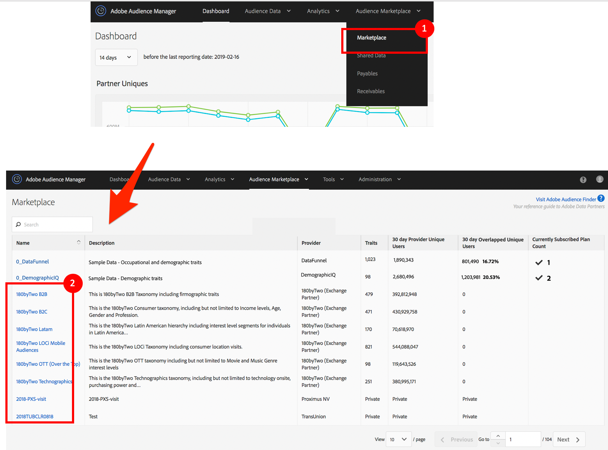
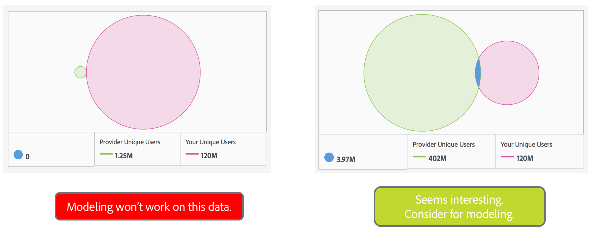

# L743 - Optimize Campaigns with Algorithmic Modeling and Audience Lab

## Table of Contents

  * [Lab Overview](#lab-overview)
  * [Lesson 1 - Introduction](#lesson-1---introduction)
    * [Exercise 1.1 - Login to Adobe Audience Manager](#exercise-11---login-to-adobe-audience-manager)
  * [Lesson 2 - Extend Sold out Inventory from Your 1st Party Data](#lesson-2---extend-sold-out-inventory-from-your-1st-party-data)
    * [Exercise 2.1 - Build a Model with 1st Party Data Sources](#exercise-21---build-a-model-with-1st-party-data-sources)
    * [Exercise 2.2 - Understanding Model Inputs](#exercise-22---understanding-model-inputs)
    * [Exercise 2.3 - Understanding Model Results](#exercise-23---understanding-model-results)
    * [Exercise 2.4 - Creating Algotithmic Trait from Model Results](#exercise-24---creating-algotithmic-trait-from-model-results)
  * [Lesson 3 - Trait Recommendations as Alternative to Look-alike Modeling](#lesson-3---trait-recommendations-as-alternative-to-look-alike-modeling)
    * [Exercise 3.1 - Trait Recommendations as Alternative to Look-alike Modeling](#exercise-31---trait-recommendations-as-alternative-to-look-alike-modeling)
  * [Lesson 4 - Discover Look-Alike Users from 2nd and 3rd Party Data](#lesson-4---discover-look-alike-users-from-2nd-and-3rd-party-data)
    * [Exercise 4.1 - Get Familiar with Audience Marketplace](#exercise-41---get-familiar-with-audience-marketplace)
  * [Lesson 5 - Measure Performance from Different Models via Audience Lab](#lesson-5---measure-performance-from-different-models-via-audience-lab)
    * [Exercise 5.1 - Set up Audience Lab Tests against 3rd Party Data](#exercise-51---set-up-audience-lab-tests-against-3rd-party-data)
  * [Lesson 6 - (Extra Credit): Measure Performance from a Single Model at Different Accuracy Levels](#lesson-6---extra-credit-measure-performance-from-a-single-model-at-different-accuracy-levels)
  * [Lesson 7 - Common Mistakes and Troubleshooting Tips](#lesson-7---common-mistakes-and-troubleshooting-tips)
    * [FAQ](#faq)
    * [Tips &amp; Gotchas](#tips--gotchas)
    * [Next Steps](#next-steps)
    * [BONUS: Use Audience Manager’s API to Create Traits, Segments, and Models](#bonus-use-audience-managers-api-to-create-traits-segments-and-models)
  * [Additional Resources](#additional-resources)
  * [Thank You!](#thank-you)

## Lab Overview

In this hands-on lab, we will learn how to use Audience Manager Look-alike Modeling in order to expand your audiences, while maintaining high target accuracy and maximizing return on marketing spend. We will walk through best practice examples of building effective look-alike models for both publishers and advertisers with TraitWeight (AAM's look-alike algorithm) based on first and third party data.

### Key Takeaways
 
* Learn tips on building and optimizing your look-alike models
* Understand model specifics and analyze results
* Learn when to use Trait Recommendations instead of Look-alike Modeling
* Build look-alike models with 2nd and 3rd party data from Audience Marketplace
* Use Adobe Audience Manager Look-alike Modeling and Audience Lab together to prove a model’s effectiveness
* Debug and fix most commonly-made mistakes

### Prerequisites

* Adobe Audience Manager

## Lesson 1 - Introduction

### Objective

1. Understand what Audience Manager is
2. Understand what Look-alike Modeling is
3. Get familiar with the Audience Manager UI

### Lesson Context

#### Audience Manager Background

Adobe Audience Manager (AAM) is Adobe’s Data Management Platform, which allows customers to connect different internal data lakes as well as various data types such as mobile data and device data, to get a complete understanding of the user. AAM currently integrates with all of the Experience Cloud solutions and many other partners in the digital marketing eco-system.
<br>

There are four key components of AAM.
<br>
<div align="center">
    <div>
        <i>Figure 1: AAM key components</i>
    </div>
    
</div>

<br>

---

AAM, however, is not just a data bank. It also provides you with free out-of-the-box features that allow you to build look-alike (algorithmic) models to expand audiences. In this lab, we will focus on three of these features:
* **Look-alike Modeling** - a feature used for building and running look-alike models.
* **Trait Recommendations** - a feature that in certain cases can be used as an alternative to look-alike modeling.
* **Audience Marketplace** - a feature where you can buy 3rd party data for your look-alike models.
* **Audience Lab** - an environment, where you can run online tests on audiences (even look-alike audiences) and measure campaign effectiveness.
  
<br>

---

Next, let's get familiar with a few key Audience Manager terms, which will be used throughout this lab:

<div align="center">
    <div>
        <i>Figure 2: AAM key terms</i>
    </div>
    
</div>
<br>

**Traits**
- Traits in AAM are the most granular behavioral features. They are collected either by the Adobe Experience Platform's (AEP) JavaScript library or via the Adobe's Mobile SDK whenever an end-user activity is detected on the client side. Traits can also be brought in via a batch onboarding process.

**Segments**
- Segments are audiences built on top of traits with boolean logic, recency, and frequency. Segments can include 1st, 2nd, or 3rd party data and can combine data from multiple profiles belonging to the same person.

**Destinations**
- Finally, and critically, marketers activate their audiences by pushing segments to various channels and enabling on-site personalization. We call these channels - destinations. Some examples of destinations are: a DSP for paid advertising or an email service provider.
<br>

---

#### What Is Look-alike Modeling?

It is the ability to take a  set of users with a given characteristic and algorithmically find a new set of users that are similar to the original set of users.

---

#### Why Use Look-alike Modeling?

Look-alike modeling can be used by both publishers and advertisers who want to maximize revenue while confidently selling and targeting audiences with high accuracy.

<div align="center">
    <div>
        <i>Figure 3: Look-alike modeling use cases key</i>
    </div>
    
</div>
<br>

---

#### Exercise 1.1 - Login to Adobe Audience Manager

Open the Google Chrome browser and go to the Audience Manager website: [https://bank-beta.demdex.com](https://bank-beta.demdex.com).

For this demo, we are going to use the Beta environment in Audience Manager, which is sandboxed from production. This is the place where we get to experiment with AAM and play with new features and ideas.

Credentials will be provided by lab instructor.

<div align="center" style="width: 300px">
    <div>
        <i>Figure 4: AAM login screen</i>
    </div>
    
</div>
<br>
Once logged in, feel free to click around and get familiar with the menu at top.
<br><br>

_Note: AAM credentials will be deactivated after Summit._ <br>
_Note: The data that you see in your account is simulated. *Your trait, segment, and data source ids will be different from the ones in the screenshots, but the names will be the same.*_ 

---

## Lesson 2 - Extend Sold out Inventory from Your 1st Party Data

### Objective
* Learn how Look-alike Modeling can be used for publishers
* Build a model
* Understand and analyze model results

### Lesson Context

<div align="center" style="width: 300px">
    <div>
        <i>Figure 5: BuildIt company logo</i>
    </div>
    
</div>

You are the Ad Sales Manager at **BuildIt** - a popular website and online community for home improvements, interior design and decorating. You have a **Garage Rehab Enthusiasts** segment audience of 15K users which has sold out and you want to extend this audience with other garage rehab look-alike users from your 1st party data.

---

#### Exercise 2.1 - Build a Model with 1st Party Data Sources

Let's go ahead and build your first look-alike model.

<div align="center">
    <div>
        <i>Figure 6: Models drop down</i>
    </div>
    
</div>
<br>

1. Click *Audience Data* -> *Models*
2. Click *Add New*
<br>

<div align="center">
    <div>
        <i>Figure 7: Model details</i>
    </div>
    
</div>
<br>

3. Name the new model *Garage Rehab Enthusiasts - 1st party*
4. Click *Browse All Traits*
5. Search for *enthusiasts*
6. Pick *Garage Rehab Enthusiasts*
7. Click *Add Selected Trait*
8. Select the *BuildIt Main* Data Source
9. [Optional] Select traits for *Exclusions*
10. Click *Save*


Congratulations! You have just created your first look-alike model. It is that easy! Now you can grab a cup of coffee. Results will be ready within 24hr. Luckily, we have already pre-run the exact same models in each of your accounts, so you don't have to wait.

---

#### Exercise 2.2 - Understanding Model Inputs

##### Baseline      
* With steps [3-7], you are selecting your baseline (seed audience) trait or segment.

##### Data Sources
* By selecting Data Sources (step 8), you tell the model which data can be used for modeling.

##### Trait Exclusions
* Trait Exclusion (step 9) provides additional controls in your modeling workflow, allowing you to add the necessary guard rails to the model, based on your domain expertise and regulatory requirements. Use the Exclusions option to select which traits to ignore when creating models from one or more data sources. Here are some use cases you can address with Trait Exclusion:
  * Trait Exclusion enables you to exclude certain catch-all traits, such as site visitor traits, so you don't bias the model, leading to flat results (i.e. every user receiving the same score).
  * You can remove traits that you don't know about or you don't trust from a data source, to better understand the influential traits.
  * You can exclude certain traits, such as demographic traits, to help with any compliance obligations you may have.

---

#### Exercise 2.3 - Understanding Model Results

To view and analyze the model results, open the **[PREGENERATED] Garage Rehab Enthusiasts - 1st party** model.<br>

Click *Models* (top left) or *Audience Data* -> *Models*

<div align="center">
    <div>
        <i>Figure 8: Model results</i>
    </div>
    
</div>
<br>

##### Spotlight

- We can see that the model generated a nice curve for the **Accuracy & Reach** graph.
- This graph gives you a sense of how many look-alike users were found at different accuracy (similarity) levels.
- The more users you want to reach, the less similar they will be to your baseline.
- The list of **Influential Traits** gives you a sense of the model learnings. These are traits that the model discovered to be highly correlated to the baseline. Our algorithm (TraitWeight) gives importance to traits that are very common to the baseline audience, but at the same time are very specific to the baseline (rare in the overall pool of users outside the baseline).
- Once the model computes the list of influential traits and assigns weights to them, it calculates a score for each user outside the baseline by adding the weights of the traits that this user has.
- In this exercise, we showcased how a publisher can model against their 1st party data. Publishers, however, often use 2nd and and 3rd party data in look-alike modeling as well:
  - As input to the model in order to further "refine" the baseline (e.g. construct a baseline = 1st party trait + 3rd party demographics data)
  - As Data Sources to model against in order to gain insights about the baseline audience and describe it before selling.

_Note: We have generated synthetic data in each of your accounts, so the reach you see may be low. In reality, you will be able to see Accuracy & Reach graphs that go up to 25MM._

---

#### Exercise 2.4 - Creating Algotithmic Trait from Model Results

Now that we have model results, let's create an algorithmic trait from it. We will generate a new algorithmic trait from the **[PREGENERATED] Garage Rehab Enthusiasts - 1st party** model. 

<div align="center">
    <div>
        <i>Figure 9: Create algorithmic trait</i>
    </div>
    
</div>
<br>

1. Scroll down to the bottom of the Model Results page. Click *Create New Trait with Model*

<div align="center">
    <div>
        <i>Figure 10: Create new algorithmic trait - basic information</i>
    </div>
    
</div>
<br>

2. Name the trait *Garage Rehab Algo Accu>85%*
3. Select *Algo-generated Data Source* as the Data Source, where the new trait will be saved
4. Pick the *Lab* folder as a specific location for storing it
5. Click on *Configuration* to expand it

<div align="center">
    <div>
        <i>Figure 11: Create new algorithmic trait - select accuracy</i>
    </div>
    
</div>
<br>

6. Select *85% Accuracy*
7. Click *Save*

Your algorithhmic trait has been created. It will take several hours for the trait to get populated. Next, you can map it to a destination and activate it.

---

## Lesson 3 - Trait Recommendations as Alternative to Look-alike Modeling

### Objective
* Learn how to use AAM's new Trait Recommendation feature as a quick way of expanding reach

### Lesson Context
Oftentimes, publishers looking to sell their inventory turn to Look-alike Modeling to either:
* Expand the reach of the audience they are trying to sell.
* Find a way of describing the audience they are selling. In order to describe the audience being sold, marketers run a look-alike model and then analyze the Influential Traits to gain new ideas about the audience composition.

This could be time-consuming. **Trait Recommendations** is a powerful new data science feature in AAM. As traits are added to a segment in the Segment Builder workflow, a table with up to 50 Trait Recommendations will appear in real-time. The table surfaces recommendations based on a similarity score against the largest traits included in the segment, pulling from any dataset currently available for segmentation. By clicking on a recommended trait, a pop-up will display additional recommendations specific to that trait. 

Trait Recommendations help marketers uncover traits that are highly relevant but may not be obvious for segment inclusion. By including these additional traits in audience segments, customers can expand their addressable audiences and improve downstream conversion rates and ROI of segments. As soon as you save the segment rule, the audience is created and can be activated. You lose the more granular result details and activation controls (e.g. Accuracy vs. Reach graph), which are present in Look-alike Modeling, but you gain audience creation and activation speed as well as unlimited use of the feature. You also have more control in crafting the segment by focusing on the specific traits in the segment you want to expand upon. This can let you do things that would be difficult with look-alike models, like creating a more focused segment by excluding users in a trait and also in similar traits. 

Trait Recommendations can also be used as an exploritory tool in order to see what other traits correlate to your baseline and thus come up with new ways of describing the audience.

#### Exercise 3.1 - Trait Recommendations as Alternative to Look-alike Modeling
Let's review the Trait Recommendations for the **Garage Rehab Enthusiasts** trait and create a brand new segment with expanded reach.

<div align="center">
    <div>
        <i>Figure 12: Segment Builder - create new segment</i>
    </div>
    
</div>
<br>

1. Click *Audience Data* -> *Segments*
2. Click *Add New*

<div align="center">
    <div>
        <i>Figure 13: Segment Builder - add basic info</i>
    </div>
    
</div>
<br>

3. Name the new segment *Garage Rehab Enthusiasts from Recommendations*
4. Select any folder (e.g. the top level *All Segments* folder)
5. Click on *Traits* to expand it

<div align="center">
    <div>
        <i>Figure 14: Segment Builder - add baseline trait</i>
    </div>
    
</div>
<br>

6. Search for the trait: *Garage Rehab Enthusiasts*
7. Click *Add Trait* to include it in the segment

<div align="center">
    <div>
        <i>Figure 15: Segment Builder - view recommendations</i>
    </div>
    
</div>
<br>

8. Click on the **+** sign to include any of the recommended traits in the segment
9. Click on any of the trait recommendation names to get additional info

<div align="center">
    <div>
        <i>Figure 16: Segment Builder - view recommendations pop-up</i>
    </div>
    
</div>
<br>

10. From the pop-up window, view the second level trait recommendations and add a few more to the segment rule by clicking on the **+** sign. 

_Note: If you want to supress recommendations from a given data source, click on the **x** sign under Data Source._<br>
_Note: If your segment rule consists of more than one trait and you want to view recommendations for each individual trait in the segment, you can click on the trait name in the segment rule and a pop-up screen will surface those._

<div align="center">
    <div>
        <i>Figure 17: Segment Builder - segment size estimator</i>
    </div>
    
</div>
<br>

11. Click *Calculate Estimates* to get an estimate of the population size for your newly-created segment
12. Click *Save*

##### Spotlight
  
In a nutshell, the main differences between Look-alike Modeling and Trait Recommendations are the following: 
1. LAM not only finds the most influential traits but also scores users based on those traits and assigns each user an individual score. With accuracy and reach, you can specify which users amongst all those who have the influential traits, you want to target. The selected users get an algo trait at the given accuracy. This algo trait is used for targeting. 
2. Look-alike Modeling enables you to select users at different accuracy levels.
3. In Look-alike Modeling, the model runs every 8 days and refreshes the users qualified for a certain algo trait.

Trait recommendations is a quick way to get insights on other traits which are similar to the ones you are using in a segment. Use Trait Recommendations instead of Look-alike Modeling if you are looking for a quick way to:
- Expand your segment reach with similar users
- Describe your baseline audience
- Need faster activation speed
- Need unlimited use of the feature

---

## Lesson 4 - Discover Look-Alike Users from 2nd and 3rd Party Data

### Objective
* Learn how Look-alike Modeling can be used for advertisers
* Learn how to use Audience Marketplace to find 2nd or 3rd party data
* Build models with 2nd and 3rd party data

### Lesson Context
You are the Digital Marketing Manager at **BuildIt** and your goal is to broaden the **Garage Rehab Enthusiasts** audience, then target these new users on other sites. Creating a look-alike model against your 1st party data is great, but the pool of new users that you will be able to reach will hit its limit eventually.

The power of Audience Manager's Look-alike Modeling gets unleashed when you seek to expand your baseline audience against a quality, brand new set of users from 2nd and 3rd party data sources. To make it easy to get that data, Audience Manager provides you with the [**Audience Marketplace**](https://marketing.adobe.com/resources/help/en_US/aam/c_audience_marketplace.html) feature. In Audience Marketplace, data sellers list their data feeds and you can choose which you'd like to use by subscribing. Reporting tools let you track feed usage and the overlap between your traits and those in a subscribed data feed.

Now let's see how we can choose 3rd party data and use it for modeling.

#### Exercise 4.1 - Get Familiar with Audience Marketplace

Navigate to Audience Marketplace and browse around.

<div align="center">
    <div>
        <i>Figure 18: Audience Marketplace</i>
    </div>
    
</div>
<br>

1. Click on *Audience Marketplace* -> *Marketplace*
2. [Optional] Explore in details 3rd party data sources in Audience Marketplace by clicking on their names

_Note: Since this is a beta environment, you can "subscribe" for as many feeds as you wish at no cost._

For this exercise, we will work with two particular data feeds: **DataFunnel** and **DemographicIQ**. Your accounts have already been subscribed to them.

<div align="center">
    <div>
        <i>Figure 19: Audience Marketplace - pre-subscribed feeds</i>
    </div>
    
</div>
<br>

---

There are so many feeds! When searching to subscribe to a 3rd party data feed, however, which one should I choose?

The **Audience Marketplace** stats for each data feed come in handy. Consider data feeds, which have a good number of unique users, and at least some overlap with your data (so your algo model can run successfully). Overlap & unique user counts are calculated for free, but you need to explicitly toggle **Segments & Overlap** for the feeds of interest (option available once you click on individual data feeds).

<div align="center" style="width: 600px">
    <div>
        <i>Figure 20: Audience Marketplace - overlaps explained</i>
    </div>
    
</div>

---
Feeds can be billed at a flat rate or by CPM. If the feed uses CPM pricing, you can enable Modeling at no cost, but once you decide to activate the data, you will need to pay according to your usage.

<div align="center" style="width: 600px">
    <div>
        <i>Figure 21: Audience Marketplace - CPM pricing</i>
    </div>
    
</div>
<br>

If the feed uses Flat Fee pricing, that will be the monthly cost that you need to pay.

<div align="center" style="width: 600px">
    <div>
        <i>Figure 22: Audience Lab - Flat Fee pricing</i>
    </div>
    
</div>
<br>

Once you have subscribed to 2nd or 3rd party data feeds, these data feeds will automatically appear in the list of available data sources for modeling. You can then repeat the steps outlined in [Exercise 2.1](#exercise-21---build-a-model-with-1st-party-data-sources) to build a model against this data.

---

## Lesson 5 - Measure Performance from Different Models via Audience Lab

### Objective
* Learn how to run active A/B tests on model results via Audience Lab

### Lesson Context

Now that you have learned how to build various models with your own data and with various 3rd party data, let's see how we can measure which models and data providers give you the best outcome. Analyzing the model results may give you some insights, but the best way to measure model performance is by running an active online test.

For this exercise, we will use an Audience Manager native feature called [**Audience Lab**](https://marketing.adobe.com/resources/help/en_US/aam/audience-lab.html).

**Audience Lab** allows customers to run A/B testing on their segments against DSPs of their choice in order to measure performance (conversion rate). 

---

#### Exercise 5.1 - Set up Audience Lab Tests against 3rd Party Data

For us, it is interesting to know which of the two 3rd party data feeds that we just "purchased" gives us better conversion rate and ROI. For this, we will measure the performance of the audiences created by two look-alike models - using the same **Garage Rehab Enthusiats** baseline, but using different 3rd party data.

We will set up two Audience Lab tests in order to measure efficacy of your models. Follow the steps below to set up a test group for your **DataFunnel** model results. You will then repeat the same steps and set up one more test group for your **DemographicIQ** model results.

To save time we have: 
* Prebuilt and ran two look-alike models with the **DataFunnel** and **DemographicIQ** 3rd party data sources
* Created algorithmic traits from each of the models with similar reach
* Mapped each of these algorithmic traits to their own segments (this is a necessary step for Audience Lab, since in AAM, only segments can be actioned to destinations)
* Created a conversion trait in order to collect conversion rate information from the Audience Lab tests and measure performance. A conversion trait is one that tracks valuable site actions such as product purchases and cart additions

<div align="center" style="width: 600px">
    <div>
        <i>Figure 23: Audience Lab - drop down</i>
    </div>
    
</div>
<br>

1. Click *Audience Data* -> *Audience Lab*

<div align="center" style="width: 600px">
    <div>
        <i>Figure 24: Audience Lab - create new test group</i>
    </div>
    
</div>
<br>

2. Click *Create New Test Group*

<div align="center" style="width: 600px">
    <div>
        <i>Figure 25: Audience Lab - add basic info</i>
    </div>
    
</div>
<br>

3. Name the Test Group *DataFunnel Test*<br>
4. Click *Choose Base Segment*, then search for the segment: *[PREGENERATED] DataFunnel - Accu > 85%*
5. When found, click on it
6. Click *Choose Segment*

<div align="center" style="width: 600px">
    <div>
        <i>Figure 26: Audience Lab - next</i>
    </div>
    
</div>
<br>

7. Click *Next*

<div align="center" style="width: 600px">
    <div>
        <i>Figure 27: Audience Lab - allocate percentages</i>
    </div>
    
</div>
<br>

8. For *Test Segment 1*, set the percentage as 10% and for *Test Segment 2*, set the percentage as 90%
9. Click Next

<div align="center" style="width: 600px">
    <div>
        <i>Figure 28: Audience Lab - select conversion trait</i>
    </div>
    
</div>
<br>

10. Click the drop down on *Add a Conversion Trait* to add *[PREGENERATED] My Conversion Trait*<br>
11. Click *Next*

<div align="center" style="width: 600px">
    <div>
        <i>Figure 29: Audience Lab - add destinations</i>
    </div>
    
</div>
<br>

12. Under *Destinations*, select *Ad Cloud* from the drop down. Drag and drop *Test Segment 2* to it. Enter *1* as the mapping value. 
13. Click *Next*

<div align="center" style="width: 600px">
    <div>
        <i>Figure 30: Audience Lab - finalize test</i>
    </div>
    
</div>
<br>

14. Click *Finalize Group*
15. Repeat the same steps above [1-14] to set up a similar test with the DemographicIQ data.

---

##### Spotlight

- You have just created two Audience Lab tests in order to determine which 3rd party data performs better.
- The **DataFunnel** and **DemographicIQ** algo audiences (**Test Segment 2**) will be sent to the same destination (AdCloud), so you can construct a valid comparison.
- Because you are comparing _conversion rates_ and not actual conversion counts, even if your algo audiences have slightly different sizes, that's ok.
- We used **Test Segment 1** for withholding some of the data. If you have a large audience and you don't want to send all of it to the destination, you can use it to retain a percentage of the data. We have chosen to withhold 10% of the data, but you can pick a number that you deem appropriate - perhaps a 50/50 split.
- Your active tests will now start collecting data and in a few days, you will be able to analyze the performance of your models and decide which of the 3rd party data sources gives you the best ROI.
- We have already run the same tests for you, so switch to the **[PREGENERATED]** tests to review results.
- We can immediately spot that the **DataFunnel** model produced much higher conversion rate than the **DemographicIQ** one.

<div align="center" style="width: 600px">
    <div>
        <i>Figure 31: Audience Lab - comparing conversion rates</i>
    </div>
    
</div>
<br>

- Aggregate and Trend Reporting on conversion rates and total conversions are also available as you open each test. Click on the test name to open and view additional reporting for each test.

<div align="center">
    <div>
        <i>Figure 32: Audience Lab - aggregate and trend reports</i>
    </div>
    
</div>
<br>

---

## Lesson 6 - (Extra Credit): Measure Performance from a Single Model at Different Accuracy Levels

### Objective
* Learn how to select optimal accuracy when creating an algo trait

Now that you have learned all the key components for building look-alike models and measuring results, can you try to design a test that measures conversion rate at different accuracy bands from one of your models?

For example, let's try to measure the performance for three groups of look-alike users:
```
HIGHEST value = accuracy [95-100]%
MEDIUM value  = accuracy [90-95]%
LOWEST value  = accuracy [80-90]%
```

_Hint: Create mutually-exclusive buckets at segment level._

<div align="center" style="width: 800px">
    <div>
        <i>Figure 33: Audience Lab - segments from different accuracy bands</i>
    </div>
    
</div>
<br>
---

## Lesson 7 - Common Mistakes and Troubleshooting Tips

### Objective
* Learn how to avoid common mistakes
* Learn tricks & tips for best model results

## FAQ

* **Q:** I am getting a flat Accuracy & Reach graph. Why?
* **A:** A flat Accuracy & Reach graph means that almost every user received the same score by the model. A very likely reason for this to happen is that you included some site visitor trait in the data sources that you modeled with. Remove this generic trait from the model input during model creation (Exclusions field).

---

* **Q:** I see that some of the top influential traits have very small audiences. Why?
* **A:** The algorithm selects traits that are highly correlated with the baseline trait, from the perspective of that trait. For example, if a given trait has 100% overlap with the baseline trait, it will have a very high weight, even if the number of users in that trait is small.

---

* **Q:** Why hasn't my model run/rerun?
* **A:** Models that have produced results will continue to run only if you have created at least one active algo trait and mapped it to an active segment and a destination.

---

* **Q:** Why didn't my model produce any results?
* **A:** This is typically caused by not having significant trait overlaps between the baseline population and population in the data sources selected.

---

* **Q:** Is there any recommendation on the baseline trait/segment size?
* **A:** A few thousand users should be sufficient given that there is significant trait overlaps between the baseline population and population in the data sources selected. Look-alike modeling will be more accurate for bigger baselines, since the statistical relationships will be stronger.

---

* **Q:** What 3rd party data sources should I pick to model against?
* **A:** Select data sources that have at least some overlap with your baseline trait/segment, but at the same time bring in additional users. Also, consider the cost associated with each data feed. Cost and pricing models vary among data providers in Audience Marketplace.

---

* **Q:** Does it cost to use 3rd party data for modeling?
* **A:** It depends on the pricing model of the data feed. Some feeds allow modeling at no cost, while others allow it at a fee.

---

* **Q:** How many models/traits am I allowed to create?
* **A:** At the moment, companies have a limit of 20 algo models and 50 algo traits.

---

* **Q:** How often does the model retraining and algo trait population refresh happen?
* **A:** Once every 8 days.

---

## Tips & Gotchas

* For best results, use highly specific baseline trait as a start. If you start modeling from a baseline trait, which is very generic, you will derive "generic" results.
* Select short lookback period - 30 days.
* As a best practice, create a new data source to store your algo traits and segments in. Do not use algo traits as baselines and do not include them with your data sources for modeling.
* Exclude generic traits such as site visitor traits into a separate data source.

---

## Next Steps

Now that you have learned how to build traits, segments, and models via the Audience Manager UI, you should try to put your new skills in action. Have fun and go ahead - build new worklows to bring better monetization for your company!

#### BONUS: Use Audience Manager’s API to Create Traits, Segments, and Models

As an added bonus, we have included a script that you could use in the future should you decide to automate the creation of traits, segments, and models for your account via the [Audience Manager's APIs](https://marketing.adobe.com/resources/help/en_US/aam/c_rest_api_main.html).

[Provisioning script for the summit test site](https://github.com/iulian-radu/Summit2018/tree/master/L757/script/)

---

## Additional Resources

* [Adobe Audience Manager documentation](https://marketing.adobe.com/resources/help/en_US/aam/)
* [Adobe Experience League](https://experienceleague.adobe.com/)

---

## Thank You!
Thank you for participating!<br>
Please rate this lab in the Summit 2019 app!

